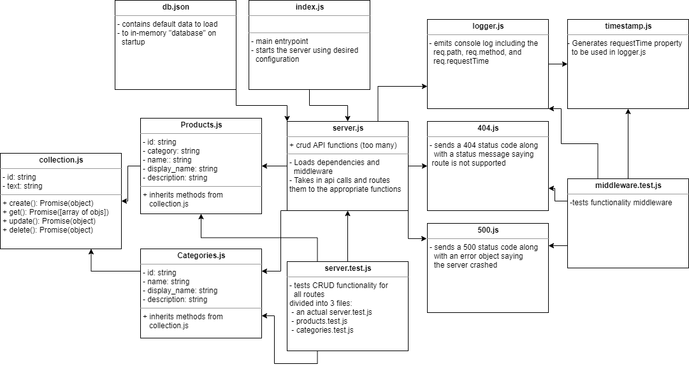

# LAB: Express (07)

## Create an Express API Server

### Author: Earl Jay Caoile

### Links and Resources

- [submission PR](https://github.com/earljay-caoile-401-advanced-javascript/api-server/pull/1)
- [GitHub Actions](https://github.com/earljay-caoile-401-advanced-javascript/api-server/actions)
- [Code Fellows Supergoose](https://www.npmjs.com/package/@code-fellows/supergoose)

#### Documentation

- [SuperAgent](https://visionmedia.github.io/superagent/)
- [using express middleware](https://expressjs.com/en/guide/using-middleware.html)
- [express routing](https://expressjs.com/en/guide/routing.html)
- [HTTP Status Codes](https://www.restapitutorial.com/httpstatuscodes.html)

### Setup

- create an .env file on the top level of this repo: `MONGODB_URI=mongodb://localhost:27017/api-server`
- install node packages locally with `npm i` from the root directory in Terminal
- the "database" operates in memory and loads the default values from db.json in the data folder
- CRUD operations can be performed while the server is running, but any changes will not persist once the server is turned off

#### Tests

- Testing command: `npm test` from root directory

### Web Server Visual Tests

- Open this [React Application](https://w638oyk7o8.csb.app/)
- In the form at the top of the page, enter the URL to your API Server
- This server is configured to use the routes noted in the first lab requirement
- If this lab is working, this app will show your API Data!

#### UML

