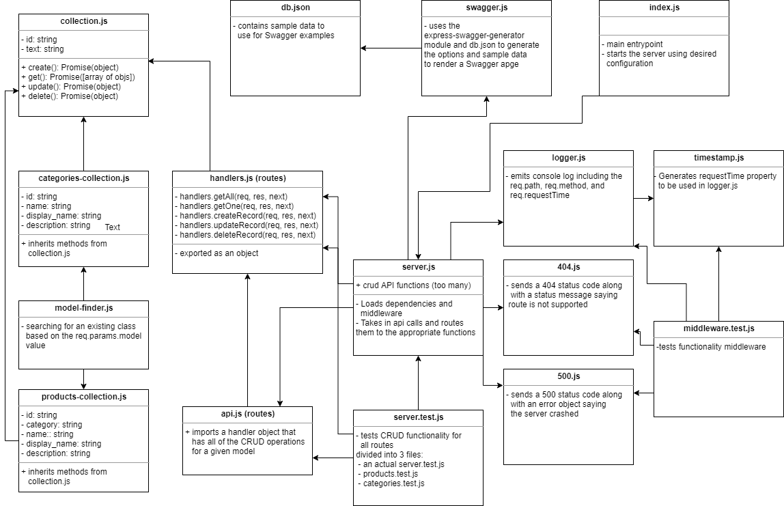

# LAB: API Server (09)

## A production ready API server with dynamic models

### Author: Earl Jay Caoile

### Links and Resources

- [submission PR](https://github.com/earljay-caoile-401-advanced-javascript/api-server/pull/3)
- [GitHub Actions](https://github.com/earljay-caoile-401-advanced-javascript/api-server/actions)
- [Heroku Deployment](https://cf-js-401-api-server.herokuapp.com/)
- [Swagger API Documentation for Heroku Deployment](https://cf-js-401-api-server.herokuapp.com/api-docs)

- [Swagger Editor (good for validation)](https://editor.swagger.io/)
- [Code Fellows Supergoose](https://www.npmjs.com/package/@code-fellows/supergoose)

### Documentation

- [SuperAgent](https://visionmedia.github.io/superagent/)
- [using express middleware](https://expressjs.com/en/guide/using-middleware.html)
- [express routing](https://expressjs.com/en/guide/routing.html)
- [HTTP Status Codes](https://www.restapitutorial.com/httpstatuscodes.html)

### Setup

#### Configuring MongoDB

- create an .env file on the top level of this repo with the following information:
  ``` 
  MONGODB_URI=mongodb://localhost:27017/api-server
  HOST=localhost:3000
  ```
- start your database with the path of the DB along with the folder location for your DB files (`mongod --dbpath=/Users/path/to/data/db`: i.e. `"C:\Program Files\MongoDB\Server\4.2\bin\mongod.exe" --dbpath="D:\db"`)
- install node packages locally with `npm i` from the root directory in Terminal
- start the server with `nodemon index.js`

**Note:** for Heroku deployment, `MONGODB_URI` needs to have a value filled out in settings. The mLab add-on handles this automatically by filling out the variable and giving you a MongoDB to use.
As of this revision, you need to put in the HOST variable as well. Mine, for example, would be `cf-js-401-api-server.herokuapp.com`

#### Tests

- Testing command: `npm test` from root directory

### Web Server Visual Tests

- Open this [React Application](https://w638oyk7o8.csb.app/)
- In the form at the top of the page, enter the URL to your API Server (use /api/v1 in addition to the base URL: i.e. `https://cf-js-401-api-server.herokuapp.com/api/v1` for the Heroku API server and `http://localhost:3000/api/v1` for the local server)
- This server is configured to use the routes noted in the first lab requirement
- If this lab is working, this app will show your API Data!


#### UML


